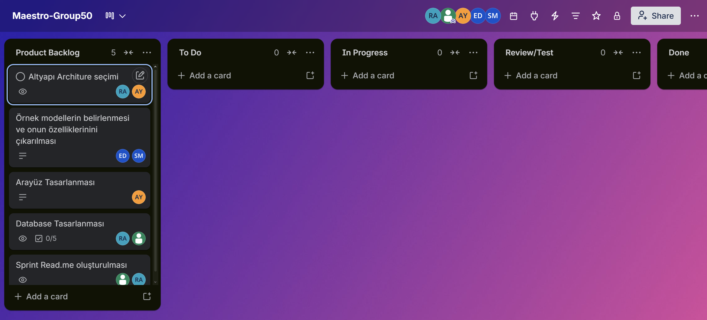
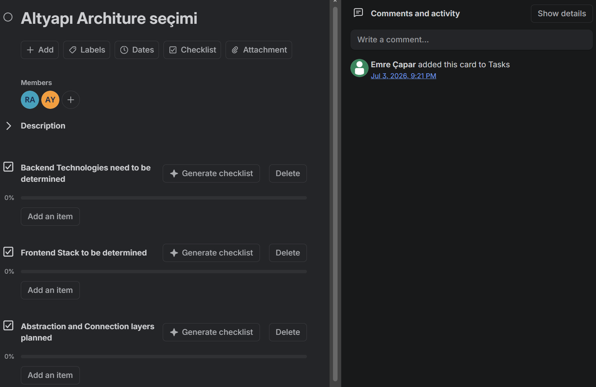
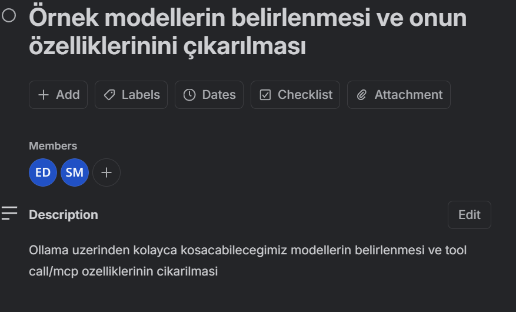
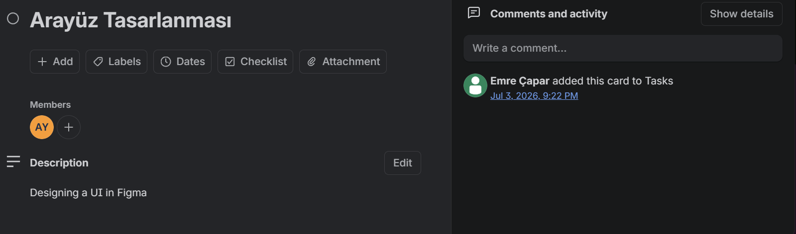
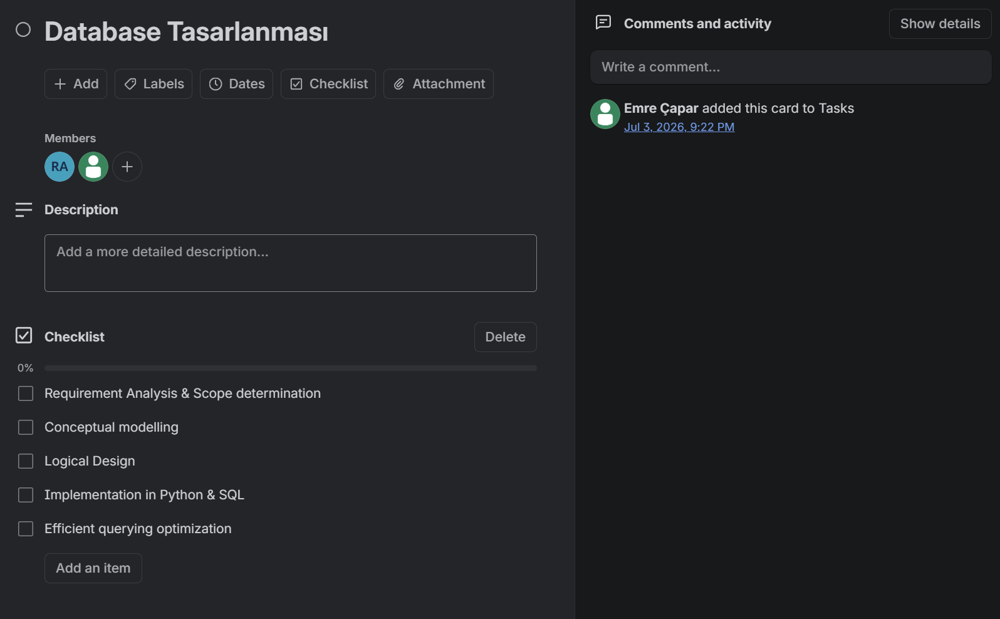
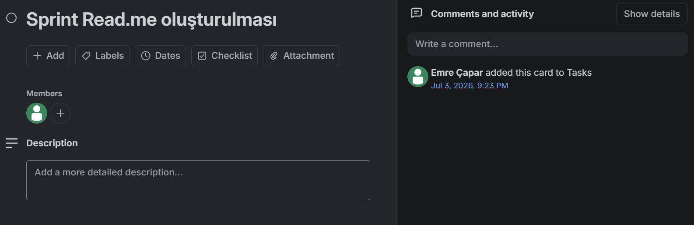
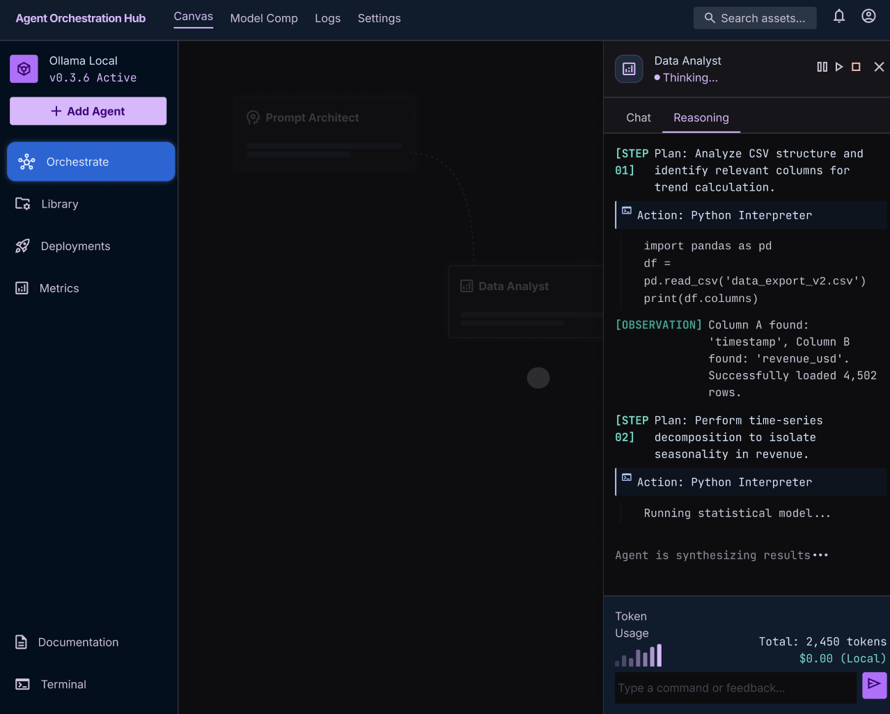
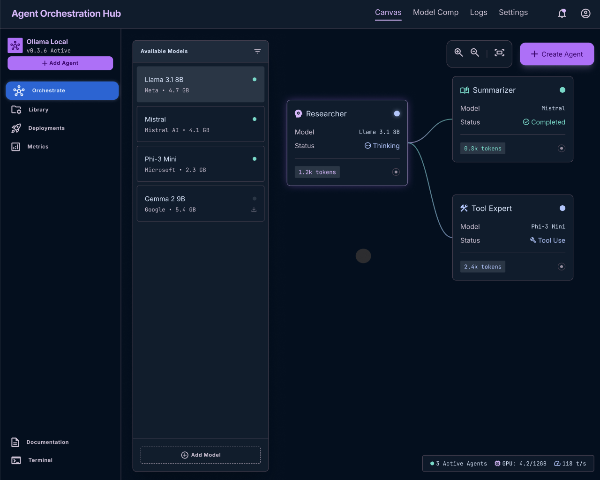
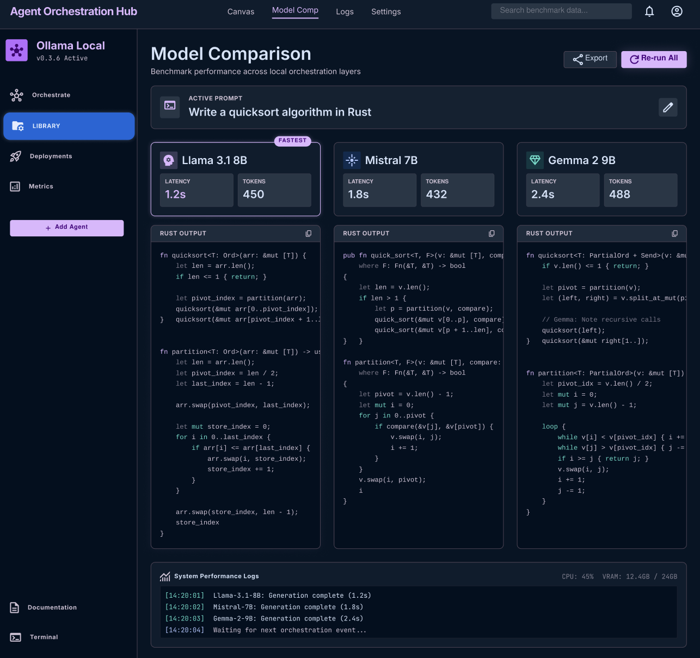

# **Takım İsmi**

Grup 70 (Maestro)

# Ürün İle İlgili Bilgiler

## Takım Elemanları

- **Roya Arkhmammadova:** Product Owner
- **Emre Çapar:** Scrum Master
- **Sudenur Mutlu:** Developer
- **Ebru Doğan:** Developer
- **Ahmet Yumutkan:** Developer

## Ürün İsmi

Maestro

## Ürün Açıklaması

- Maestro, dağınık şekilde terminal pencerelerinde, ayrı script'lerde veya tek seferlik chat oturumlarında yürütülen agent tabanlı çalışmalara görsel ve tek bir merkez kazandırmayı hedefleyen, yerel (local) olarak çalıştırılan bir web uygulamasıdır. Node tabanlı workflow araçlarından ilham alan arayüzünde her agent, canvas üzerinde bir kare node olarak temsil edilir.
- Kullanıcı "+" butonuna basarak model ve temel ayarları seçip manuel olarak agent oluşturabilir; bir agent kendi içinden bir subagent oluşturduğunda ise bu yeni node otomatik olarak canvas'a eklenir ve ebeveyn agent'a bağlanır. Böylece canvas, elle çizilmiş bir diyagramdan öte, işin gerçek zamanda nasıl devredildiğini gösteren canlı bir haritaya dönüşür.
- Herhangi bir node'a tıklandığında o agent'ın tüm konuşma ve reasoning (düşünme) geçmişi görüntülenebilir, kullanıcı görev devam ederken yeni bir talimatla araya girebilir.
- Uygulama tamamen yerelde çalışır: model katmanı için Ollama kullanılır, bulut altyapısına veya harici hesaplara ihtiyaç duyulmaz.

## Ürün Özellikleri

- Canvas üzerinde "+" butonu ile manuel agent oluşturma (Ollama'dan model seçimi ve temel ayarlar)
- Her agent için ayrı bir çalışma penceresi: prompt kutusu, canlı çıktı ve reasoning/düşünme süreci gösterimi, devam eden konuşma geçmişi
- Aynı anda çalışan 2 ayrı Ollama modeli/agent'ı
- Agent'ların ortak kullandığı tek bir tool: yerel dosya sisteminde okuma/yazma
- Node ikonlarında canlı durum göstergesi: `idle`, `thinking`, `tool_calling`, `error`, `done`, `queued`
- Agent process'i çökerse hata durumuna geçme ve yeniden başlatma aksiyonu; parent agent çökerse subagent'larının da durdurulup tek aksiyonla birlikte yeniden başlatılabilmesi
- Oturum süresince SQLite üzerinde durum saklama (restart sonrası kalıcılık yok — v1 için bilinçli olarak kapsam dışı bırakılmıştır)

## İleride Eklenebilecek Özellikler

- Agent'ların görevin bir kısmını otomatik olarak bir subagent'a devredebilmesi (otomatik subagent oluşturma ve otomatik edge çizimi)
- Tek paylaşımlı tool yerine, agent başına seçilebilen geniş bir tool kayıt defteri (web search, code execution, custom tool'lar)
- MCP (Model Context Protocol) desteği ile tool ve entegrasyonların hardcoded fonksiyonlar yerine MCP sunucuları üzerinden sağlanması
- Agent başına "effort" (çaba) seviyesi ayarı ile hız/derinlik dengesinin kurulabilmesi
- Restart sonrası kalıcılık ve çoklu oturum geçmişi
- Token kontrolü / kullanım takibi
- Farklı modeller için sonuç karşılaştırma
- Düşünme (reasoning) sürecinin takibi ve geçmiş logların saklanması
- Agent'ları durdurma / devam ettirme (pause & resume)
- Agent ve prompt ayarlarını içeren bir config oluşturup bu config'i diğer kullanıcılarla paylaşarak workflow'un kolayca kopyalanabilmesi

## Hedef Kitle

- Yerelde (local) AI agent'larıyla çalışan geliştiriciler
- Çoklu-agent (multi-agent) sistemlerle deney yapan AI meraklıları
- Ollama gibi lokal model çalıştırma araçlarını aktif kullanan kişiler
- Agent iş akışlarını görsel olarak takip etmek ve yönetmek isteyen teknik ekipler
- n8n gibi node tabanlı, no-code/low-code araçlara aşina kullanıcılar

## Product Backlog URL

[Trello Backlog Board](https://trello.com/b/wsNq02nB/maestro-group70)

---

# Sprint 1

- **Backlog düzeni ve Story seçimleri**: Product Backlog, projenin temelini oluşturacak story'lere göre düzenlenmiştir: altyapı mimarisinin seçilmesi, örnek modellerin belirlenip özelliklerinin çıkarılması, arayüzün tasarlanması, database'in tasarlanması ve sprint README'sinin oluşturulması. Story'ler, kart içi checklist'ler aracılığıyla alt görevlere (task) bölünmüştür. Kapsam kaymasını önlemek ve MVP sınırlarına sadık kalabilmek adına takımdaki tüm roller yetkinlik alanlarına göre atanmıştır.
- **Daily Scrum**: Google Meet ve asenkron olarak Slack/WhatsApp kanalları üzerinden, ekibin uygunluk durumuna göre haftada en az 3 kez olacak şekilde organize edilmektedir. 

- **Sprint board update**: Sprint board screenshotları: 

- **Ürün Durumu**: Ekran görüntüleri: 

- **Sprint Review**:
* **Alınan Kararlar:** v1 demo'nun laptop üzerinde sorunsuz çalışabilmesi için auth ve restart sonrası kalıcılık bilinçli olarak kapsam dışı bırakılmıştır. Otomatik subagent oluşturma, çoklu tool desteği, MCP entegrasyonu ve effort seviyesi ayarları sonraki versiyonlara ertelenmiştir. Ayrıca token kontrolü, farklı modeller arası sonuç karşılaştırma, reasoning geçmişinin loglanması, agent durdurma/devam ettirme ve paylaşılabilir config fikirleri backlog'a not düşülmüştür.
* **Katılımcılar:** Tüm takım üyeleri katılım sağlamıştır.

- **Sprint Retrospective:**
  - Mimari kararların (frontend/backend teknoloji seçimleri) sprint başında netleştirilmesi gerektiği görülmüştür
  - Ollama model kurulumlarının sprint başlangıcında tamamlanmasına özen gösterilmeli
  - Tool-calling akışının test edilmesi için ayrılan efor/saat ayirilmali
  - Tahmin puanları gözden geçirilmeli ve sprint planlama toplantılarında developer'lardan gerekli geri bildirim alınmalı

---

# Sprint 2

---

# Sprint 3

---
